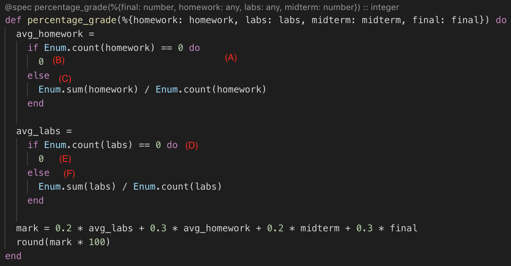
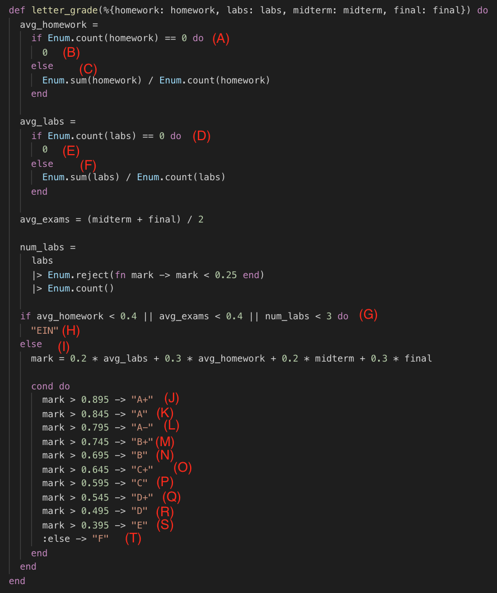
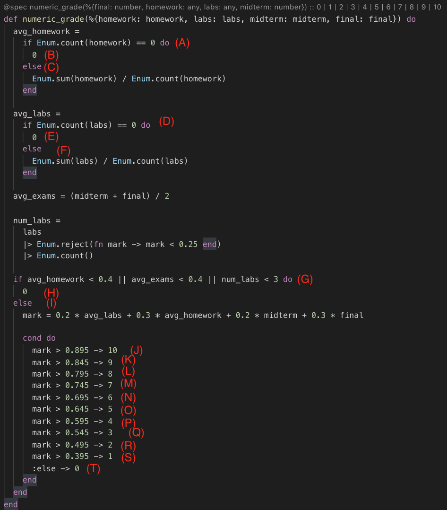
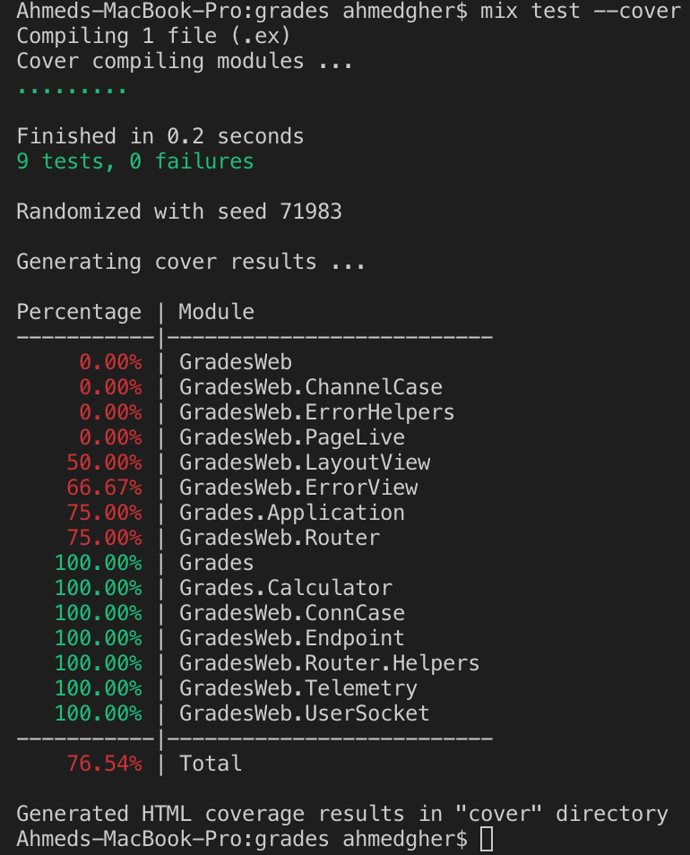

Ahmed Gheriani, 8288426
Farajj Gtat, 8242966

# Assignment 2 SEG3103

## Problem 1

###Question 1.1

percentage_grade

letter_grade

numeric_grade

###Question 1.2

| Test Case | Test Data                                                          | Expected Result | Conditions Covered | Branches Covered                  |
|:---------:|--------------------------------------------------------------------|:---------------:|:------------------:|-----------------------------------|
|   Sample  | homework = [0.8] labs = [1,1,1] midterm = 0.7 final = 0.9          |        85       |         2/4        |              A,C,D,F              |
|     1     | homework = empty labs = empty midterm = 0.70 final = 0.90          |        41       |         2/4        |              A,B,D,E              |
|           |                                                                    |                 |                    |                                   |
|     2     | homework = [0.4] labs = [0.25,0.25,0.25] midterm = 0.4 final = 0.4 |        F        |        18/27       | A,C,D,F,G,I,J,K,L,M,N,O,P,Q,R,S,T |
|     3     | homework = [] labs = [0.9] midterm = 0.2 final = 0.4               |       EIN       |        5/27        | A,B,D,F,G,H                       |
|     4     | homework = [1] labs = [1,1,1] midterm = 1 final = 1                |        A+       |        7/27        | A,C,D,F,G,I,J                     |
|     5     | homework = [0.6]  labs = [1,1,1]  midterm = 1 final = 0.95         |        A        |        8/27        | A,C,D,F,G,I,J,K                   |
|     6     | homework = [0.4]  labs = [1,1,1]  midterm = 1 final = 1            |        A-       |        9/27        | A,C,D,F,G,I,J,K,L                 |
|     7     | homework = [0.4]  labs = [1,1,1]  midterm = 0.9  final = 0.9       |        B+       |        10/27       | A,C,D,F,G,I,J,K,L,M               |
|     8     | homework = [0.4]  labs = [1,1,1]  midterm = 0.8 final = 0.85       |        B        |        11/27       | A,C,D,F,G,I,J,K,L,M,N             |
|     9     | homework = [0.4]  labs = [1,1,1]  midterm = 0.7 final = 0.75       |        C+       |        12/27       | A,C,D,F,G,I,J,K,L,M,N,O           |
|     10    | homework = [0.4]  labs = [1,1,1]  midterm = 0.65  final = 0.65     |        C        |        13/27       | A,C,D,F,G,I,J,K,L,M,N,O,P         |
|     11    | homework = [0.4]  labs = [1,1,1]  midterm = 0.5  final = 0.55      |        D+       |        14/27       | A,C,D,F,G,I,J,K,L,M,N,O,P,Q       |
|     12    | homework = [0.4]  labs = [1,1,1]  midterm = 0.4  final = 0.4       |        D        |        15/27       | A,C,D,F,G,I,J,K,L,M,N,O,P,Q,R     |
|     13    | homework = [0.4]  labs = [.5,.5,.5]  midterm = 0.4  final = 0.4    |        E        |        16/27       | A,C,D,F,G,I,J,K,L,M,N,O,P,Q,R,S   |
|           |                                                                    |                 |                    |                                   |
|     14    | homework = [0.4] labs = [0.25,0.25,0.25] midterm = 0.4 final = 0.4 |        0        |        17/27       | A,C,D,F,G,I,J,K,L,M,N,O,P,Q,R,S,T |
|     15    | homework = [] labs = [] midterm = 0.2 final = 0.4                  |        0        |        5/27        | A,B,D,E,G,H                       |
|     16    | homework = [1] labs = [1,1,1] midterm = 1 final = 1                |        10       |        7/27        | A,C,D,F,G,I,J,K                   |
|     17    | homework = [0.6]  labs = [1,1,1]  midterm = 1 final = 0.95         |        9        |        8/27        | A,C,D,F,G,I,J,K,L                 |
|     18    | homework = [0.4]  labs = [1,1,1]  midterm = 1 final = 1            |        8        |        9/27        | A,C,D,F,G,I,J,K,L,M               |
|     19    | homework = [0.4]  labs = [1,1,1]  midterm = .9 final = .9          |        7        |        10/27       | A,C,D,F,G,I,J,K,L,M,N             |
|     20    | homework = [0.4]  labs = [1,1,1]  midterm = .8 final = .85         |        6        |        11/27       | A,C,D,F,G,I,J,K,L,M,N,O           |
|     21    | homework = [0.4]  labs = [1,1,1]  midterm = .7 final = .75         |        5        |        12/27       | A,C,D,F,G,I,J,K,L,M,N,O,P         |
|     22    | homework = [0.4]  labs = [1,1,1]  midterm = .65 final = .65        |        4        |        13/27       | A,C,D,F,G,I,J,K,L,M,N,O,P,Q       |
|     23    | homework = [0.4]  labs = [1,1,1]  midterm = .5 final = .55         |        3        |        14/27       | A,C,D,F,G,I,J,K,L,M,N,O,P,Q,R     |
|     24    | homework = [0.4]  labs = [1,1,1]  midterm = .4 final = .4          |        2        |        15/27       | A,C,D,F,G,I,J,K,L,M,N,O,P,Q,R,S   |
|     25    | homework = [0.4]  labs = [.5,.5,.5]  midterm = .4 final = .4       |        1        |        16/27       | A,C,D,F,G,I,J,K,L,M,N,O,P,Q,R,S,T |

###Question 1.3

Code located in calculator_test.exs

###Question 1.4

We managed to achieve 100% in statement coverage in addition to 100% in branch coverage. Following is a screenshot of the calculator coverage.

##Problem 2

Refactored code located in calculator.ex
