Ahmed Gheriani, 8288426
Farajj Gtat, 8242966

GITHUB REPOSITORY https://github.com/Farajj/seg3103_playground/tree/main/assignment3

# Assignment 3 SEG3103

## Question 1

F1: Positive, validate that a book is successfully added if the admin enters the required attributes (book ID/author/etc). Negative, validate that a book with no author and category is not successfully added to the catalogue.

F2: Positive, validate that searching for an existing category returns all books in said category. Negative, validate that a non-ascii character does not work.

F3: Positive, validate that clicking "Add to Cart" on a specific book will add 1 copy to the user's order. Negative, user tries to update number of orders to a number that is bigger than the available stock.

F4: Positive, clicking on the cart icon allows the user to see all the books in their order. Negative, some of the info that should be displayed is not displayed.

F5: Positive, the user inputs 3 in the field, and the order is updated to be 3 books. Negative, enter a non-numeric character in the input field.

F6: Positive, clicking the "Proceed to checkout" button takes the user to the checkout page where the order information is shown. Negative, the system presents incorrect information.

F7: Positive, when the admin clicks on the "Delete" button, the book is removed from the catalogue. Negative, when the admin clicks on "Delete" the book is not deleted.

F8: Positive, validate that credentials entered by the admin successfully log them into the system. Negative, valid credentials do not log the admin into the system.

## Question 2

### C1

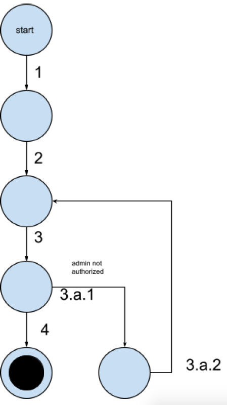

| ID  | Events                | Description                                                                      |
|-----|-----------------------|----------------------------------------------------------------------------------|
| 1.1 | 1-2-3-4               | admin enters credentials and is authorized                                       |
| 1.2 | 1-2-3.a.1-3.a.2-2-3-4 | admin enters invalid credentials, not authorized, has to enter valid credentials |

#### TC1.1

| External Event               | Expected Reaction                                                          | Comments |
|------------------------------|----------------------------------------------------------------------------|----------|
| user=admin password=password | admin is logged in, admin can perform  operations on the store’s catalogue |          |

#### TC1.2

| External Event        | Expected Reaction                            | Comments      |
|-----------------------|----------------------------------------------|---------------|
| user=abc password=123 | bookstore displays invalid credentials error | not logged in |

### C2

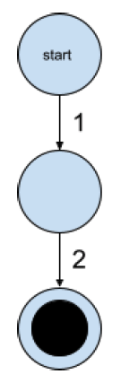

| ID  | Events | Description                  |
|-----|--------|------------------------------|
| 2.1 | 1-2    | admin is signed out by store |

#### TC2.1

| External Event   | Expected Reaction           | Comments |
|------------------|-----------------------------|----------|
| sign out clicked | admin not logged in anymore |          |

### C3

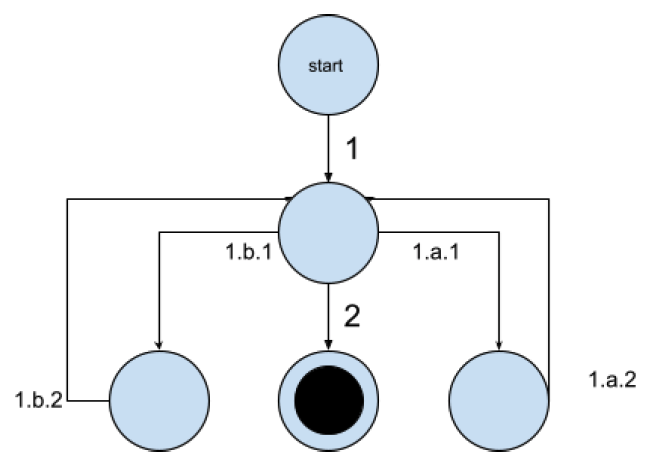

| ID  | Events      | Description                 |
|-----|-------------|-----------------------------|
| 3.1 | 1-2         | book is entered by admin    |
| 3.2 | 1-1.a.1-1-2 | admin enters missing info   |
| 3.3 | 1-1.b.1-1-2 | admin enters duplicate info |

#### TC3.1

| External Event                                                                          | Expected Reaction       | Comments                |
|-----------------------------------------------------------------------------------------|-------------------------|-------------------------|
| category=fantasy book ID = hall100 title = game of thrones author = grrm cost = $100.99 | book added to catalogue | admin enters valid info |

#### TC3.2

| External Event                                         | Expected Reaction       | Comments                  |
|--------------------------------------------------------|-------------------------|---------------------------|
| category= book ID = hall008 title =  author =  cost =  | pertinent error message | admin enters missing info |

#### TC3.3

| External Event                                                              | Expected Reaction         | Comments                       |
|-----------------------------------------------------------------------------|---------------------------|--------------------------------|
| category=action book ID = hall100 title = book author = grrm2 cost = $50.99 | duplicate book ID message | admin enters duplicate book ID |

### C4

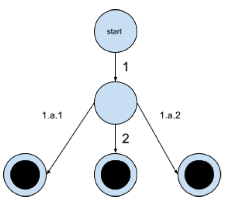

| ID  | Events  | Description                            |
|-----|---------|----------------------------------------|
| 4.1 | 1-2     | bookstore shows books of the category  |
| 4.2 | 1-1.a.1 | bookstore shows all books in catalogue |
| 4.3 | 1-1.b.1 | bookstore shows no books               |

#### TC4.1

| External Event     | Expected Reaction                                 | Comments |
|--------------------|---------------------------------------------------|----------|
| category = fantasy | bookstore shows list of books satisfying category |          |

#### TC4.2

| External Event | Expected Reaction         | Comments               |
|----------------|---------------------------|------------------------|
| category =     | bookstore shows all books | no category, all books |

#### TC4.3

| External Event    | Expected Reaction              | Comments                   |
|-------------------|--------------------------------|----------------------------|
| category = romcom | no matching book found message | no books for that category |

### C5

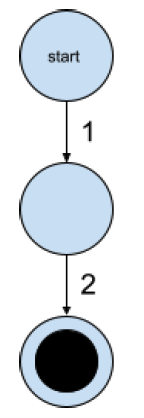

| ID  | Events  | Description                            |
|-----|---------|----------------------------------------|
| 5.1 | 1-2     | admin removes book from catalogue      |

#### TC5.1

| External Event        | Expected Reaction                             | Comments           |
|-----------------------|-----------------------------------------------|--------------------|
| delete button clicked | bookstore shows list of books minus that book | admin deletes book |

### C6

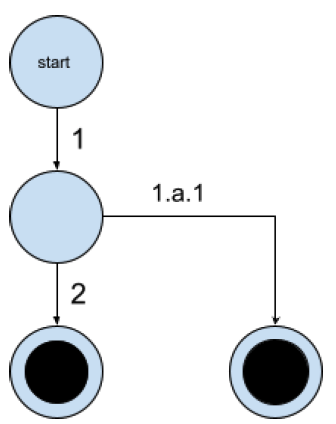

| ID  | Events  | Description                               |
|-----|---------|-------------------------------------------|
| 6.1 | 1-2     | book is added to user's order             |
| 6.2 | 1-1.a.1 | book count is incremented in user's order |

#### TC6.1

| External Event          | Expected Reaction                  | Comments       |
|-------------------------|------------------------------------|----------------|
| user clicks add to cart | bookstore adds book to user's cart | user adds book |

#### TC6.2

| External Event          | Expected Reaction                            | Comments                               |
|-------------------------|----------------------------------------------|----------------------------------------|
| user clicks add to cart | bookstore increments number of books in cart | user clicks add to cart more than once |

### C7

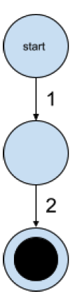

| ID  | Events  | Description                               |
|-----|---------|-------------------------------------------|
| 7.1 | 1-2     | book order is shown to user               |

#### TC7.1

| External Event          | Expected Reaction                | Comments |
|-------------------------|----------------------------------|----------|
| user clicks cart button | bookstore shows books order info |          |

### C8

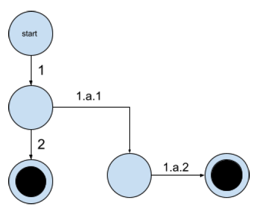

| ID  | Events        | Description                |
|-----|---------------|----------------------------|
| 8.1 | 1-2           | total cost is updated      |
| 8.2 | 1-1.a.1-1.a.2 | book is removed from order |

#### TC8.1

| External Event | Expected Reaction                       | Comments                     |
|----------------|-----------------------------------------|------------------------------|
| number = 10    | bookstore updates total cost to cost*10 | customer updates # of copies |

#### TC8.2

| External Event | Expected Reaction                 | Comments                      |
|----------------|-----------------------------------|-------------------------------|
| number = 0     | bookstore removes book from order | customer no longer wants book |

### C9

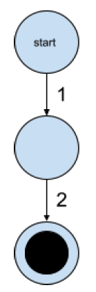

| ID  | Events | Description                                       |
|-----|--------|---------------------------------------------------|
| 9.1 | 1-2    | system processes order and checkout info is shown |

#### TC9.1

| External Event | Expected Reaction                                 | Comments            |
|----------------|---------------------------------------------------|---------------------|
| click checkout | bookstore processes order and displays order info | customer checks out |

### C10

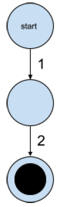

| ID   | Events | Description                        |
|------|--------|------------------------------------|
| 10.1 | 1-2    | bookstore changes language of page |

#### TC10.1

| External Event      | Expected Reaction                            | Comments         |
|---------------------|----------------------------------------------|------------------|
| language is toggled | bookstore displays info in selected language | language changed |

## Question 3

Implementation for functional requirements and use case scenarios above were implemented in ExampleSeleniumTest.java.

Note that we had issues with the appliction not running the server, so we had to comment out lines 30-34 (the lines that are responsible for running the server). Instead, we ran the app in a different terminal before running the tests.

Below are the results of running the 15 test cases that were implemented.

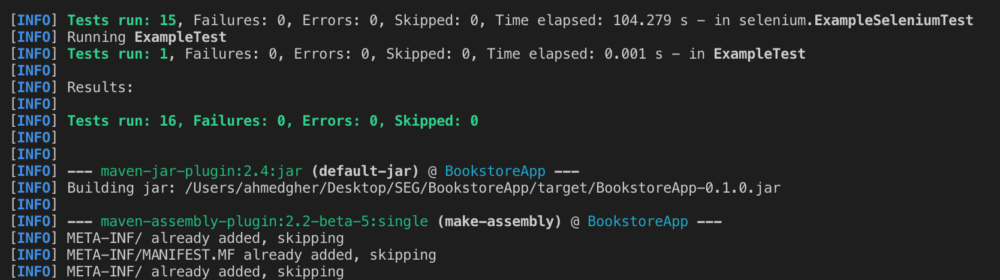

