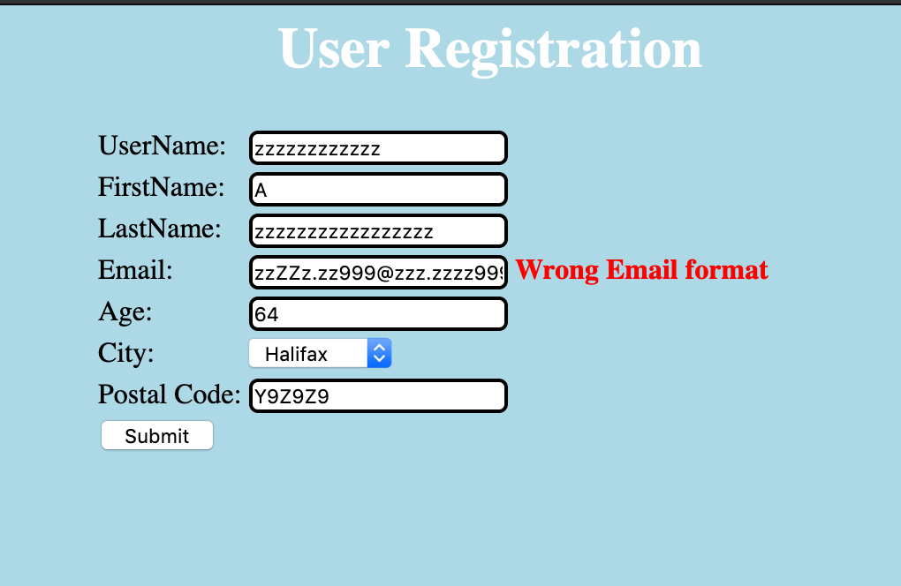
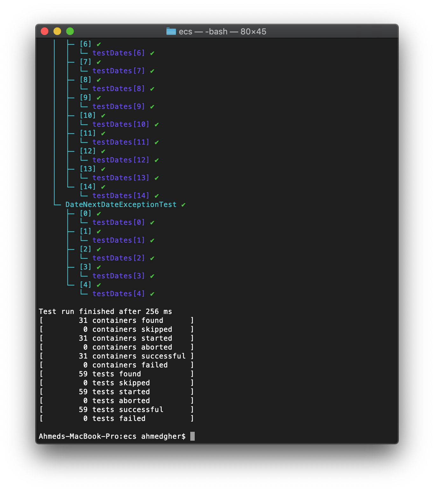

Ahmed Gheriani, 8288426
Farajj Gtat, 8242966

Exercise #1

| Test Case |        Expected Result        |         Actual Result         | Verdict (P/F/Inc) |
|:---------:|:-----------------------------:|:-----------------------------:|-------------------|
|     1     | registration request accepted | registration request accepted | Pass              |
|     2     | registration request accepted |       Wrong Email format      | Fail              |
|     3     | registration request accepted | registration request accepted | Pass              |
|     4     | registration request accepted | registration request accepted | Pass              |
|     5     |              Err1             |              Err1             | Pass              |
|     6     |              Err3             |              Err3             | Pass              |
|     7     |              Err3             | UserName between 6 & 12 chars | Fail              |
|     8     |              Err1             |              Err1             | Pass              |

Exercise #2

Code is located in the JUnit_code directory.

