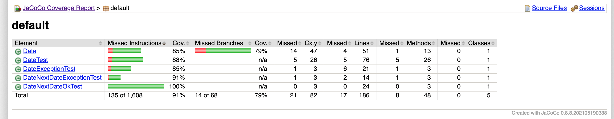
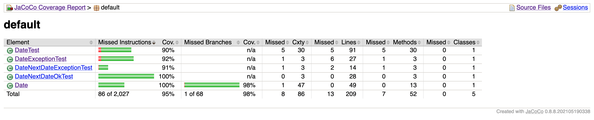
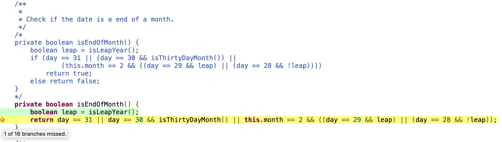

Ahmed Gheriani, 8288426
Farajj Gtat, 8242966

# Lab03

### Exercise (Test suite for Date.java and refactoring of Data.java) 

For this exercise, we had to expand on the test suite provided to us so that the coverage is increased as close to 100% as possible.

First, a screenshot of the coverage before we added our own tests: 

After adding roughly 10-15 of our own tests, our coverage for the Date class increased from 85% to 100%.

All branches in the Date class were covered through tests except for 1 branch (of 16) from the isEndOfMonth() method. We believe that the branch that was not covered had to do with the (day == 29 && leap) statement, as it was possible to test if day == 29 && leap is the end of the month, but it was not possible to test if the day == 29 && !leap was the end of the month (initializing februray 29th for a non-leap year gives an error). We thought refactoring the code would show us an improvement, but could not find a way to cover that branch.

In the screenshot below, you see the original code commented out along with our final refactored code. Every branch has been covered but the 1.

