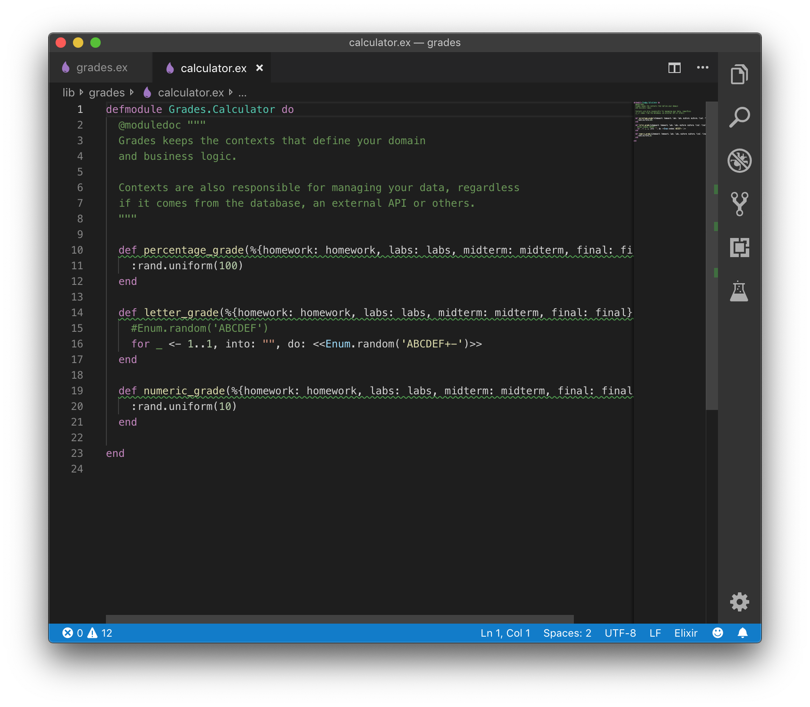

Ahmed Gheriani, 8288426
Farajj Gtat, 8242966

# Lab05

### Part 1 (Grades calculator)

When first trying to run the server, we got unchecked dependencies as follows:

In order to fix this we had to get the dependencies as follows:

After that, we had to install npm as follows:

Now that we've done all that, we were able to run the application on localhost:4000

As mentioned in the lab, the application does not work as is. Our first task was to add the stubs. This was done with the following code:

Now that we've achieved the step with the stubs, we were instructed to replace the code with code that should function. We did this by adding code similar to that of assignment 2 (can be seen in the github repository). We know the code works, as it worked for A2, but in this case we got an error:

We believe the reason for this error is that the application is treating the numbers as strings. Therefore, elixir is not able to do the arithmetic.

### Part 2 (Twitter)

For this part, we had to implement 4 test cases to test this twitter app. Our test cases follow:

After implementing these test cases, we were able to pass more tests.

As seen in the screenshot, 5 tests passed and 2 failed. However, we noticed that with multiple runs this value changes. It can either be 5 passed 2 failed or 4 passed 3 failed. 

