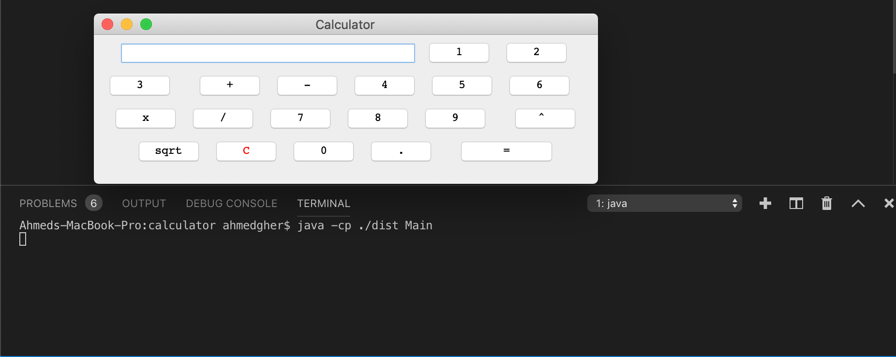
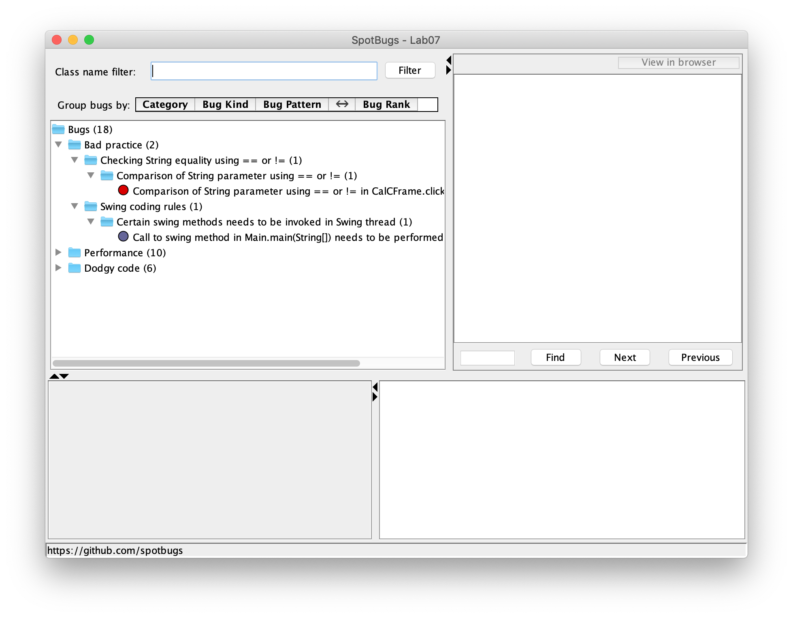
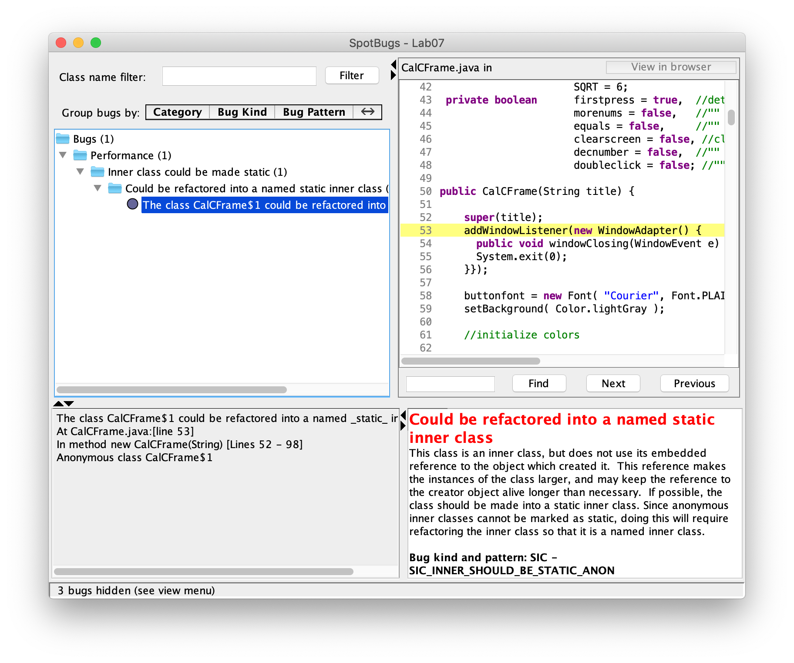

Ahmed Gheriani, 8288426
Farajj Gtat, 8242966

# Lab07

The first part of the lab was to compile the application and tests, and then run the application. Screenshot follows of the app:

After that, we installed FindBugs and linked it to our application. After analyzing the project, we got the following:

We are able to fix all the bugs by modifying the code, except for one:

It's clear that the bug stems from the super keyword and that the CalCFrame class must be refactored into a static class in order to fix the issue.

The changed code is located in the Github files. src -> CalCFrame.java, src -> Main.java, and test -> CalCFrameTest.java.